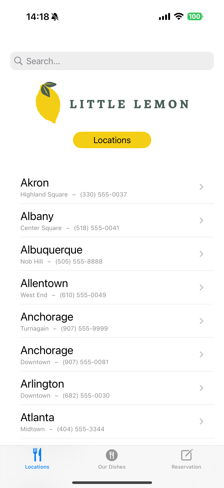
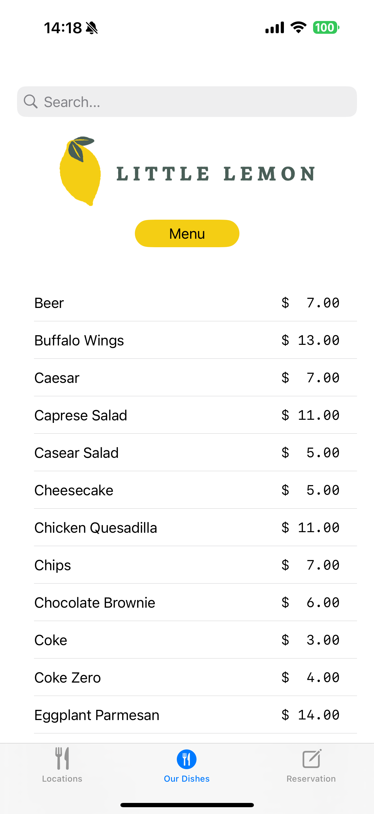
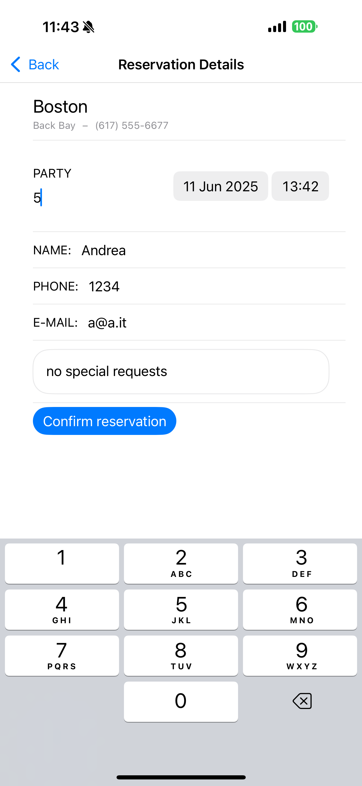
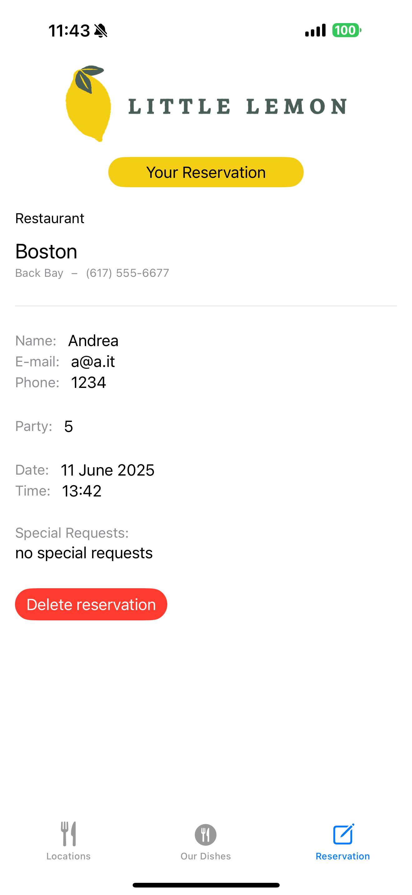

# CoreData Refresh Project

A lightweight SwiftUI-based project with the main goal of refreshing and deepening my understanding of **Core Data** integration in modern iOS apps.

> 🎯 This marks the first step of my personal journey started to recover the gap after 2+ years away from native iOS development due to academic commitments and a cross-platform project developed.

## 📌 Main Focus

The core of this project is centered around **Core Data** usage patterns, efficiency, and architectural decisions. Various use cases are tackled using different strategies to evaluate trade-offs and best practices.

---

## 📶 Network Monitoring

- Implements a **Network Monitor** to detect real-time connection changes.
- Data synchronization is conditional based on network availability at app launch.

---

## 🗺️ Locations

- **Delta-based sync**: Always fetches deltas from the server if a connection is available.
- On first launch, the **entire dataset** is fetched (suboptimal by design I know, but focus was elsewhere).
- Implements **View ↔ ViewModel ↔ Core Data** flow:
  - The view communicates with a ViewModel.
  - The ViewModel handles data retrieval and change management.
  - Data is retrieved from Core Data **in batches** to avoid memory saturation.
- Architecture is **decoupled** for maintainability and testability.

---

## 🍽️ Dishes

- Same delta-fetching logic as Locations.
- However, Core Data is **integrated directly into the View**.
- Purpose: Explore SwiftUI's native support for Core Data and observe performance/scalability when you're sure dataset is always small (e.g., menu items).
- Example of using `@FetchRequest` directly in views.

---

## 📅 Reservation

- Assumes only **one active reservation** at any time.
- New reservations **overwrite the old one** without warning (by design, because focus was elsewhere).
- All operations go through Core Data (save and fetch).
- Simplified logic, not the main architectural focus.

---

## 🛠️ Built With

- **SwiftUI**
- **Core Data**
- **Combine**
- **Network framework** for connectivity monitoring

---

## 📈 Future Improvements

I will continue to explore other architectural aspects to refresh and improve my skills with other public demo projects, but I will be back with:

- Proper delta sync logic with local hashing/versioning
- Add unit and UI tests
- Improve user feedback and error handling
- Full offline-first design
- Real-time sync upon reconnection

---

## Previews

  
  
  
  

